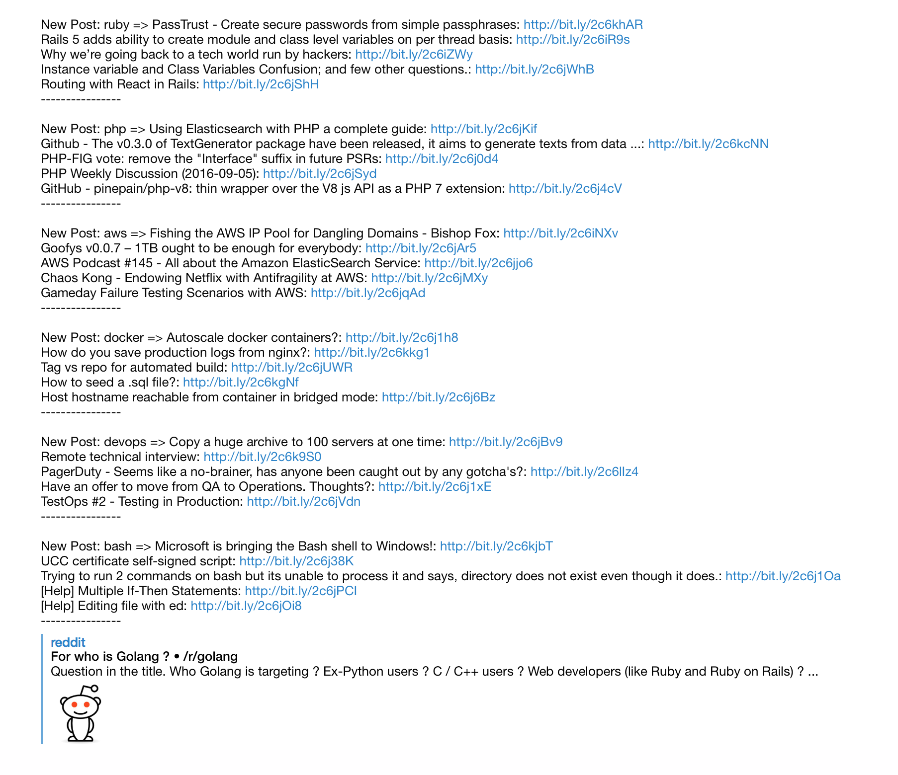

# Rscrap

Ruby Web Scraper [Telegram](https://telegram.org/) Bot.

# Setup

First, you need to obtain a Telegram Bot token, by following this guide: [Telegram Bot How-To](https://core.telegram.org/bots).

After that, obtain your personal Telegram ID. Put both of these into their respective environment variables:

```bash
export RSCRAP_TOKEN=xxxxxxxx:ASDFffwf34444
export RSCRAP_USER_ID=111111111
```

Than run `bundle install` in the ruby folder to install all the gems. Once that's finished, setup the db with `bundle exec ruby init_db.rb`.

# Creating a Cron Job for running

Create a crontab if you don't have any:
```bash
crontab -e
```

And add this line:

```bash
0,45 * * * * /bin/bash -l -c 'cd /home/<user>/rubyproj/rscrap && bundle exec ruby scripts/reddit.rb'
```

For reddit, I recommend a 45 minute refresh rate based on how many subreddits you are following. You don't want to spam yourself too much. And the bot does handle bulk updates.

# URL Shortening option for reddit urls

RScrap now supports URL shortening using [bit.ly](https://bit.ly). Just set up these two environment properties:

```bash
export RSCRAP_BITLY_USERNAME=username
export RSCRAP_BITLY_API_KEY=api_key
```

This is how it looks like with shortened URLS:



# Example

After the scrip runs you should see something like this from your bot:


# Contribute

Contributions, issues, and PRs are very welcomed.
